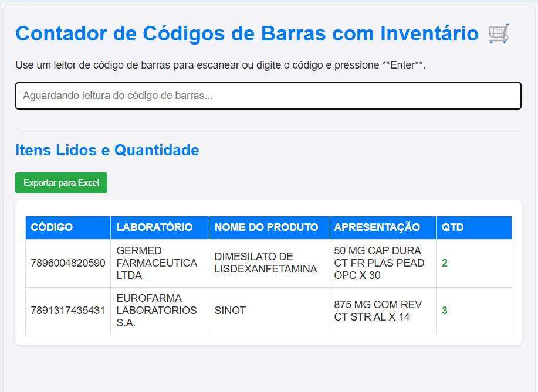

# 📦 Barcode Inventory Manager

> Uma ferramenta ágil para contagem de estoque e inventário farmacêutico através da leitura de códigos de barras, voltada ao controle de medicamentos sujeitos a prescrição especial e antibióticos.

## 🎯 Sobre o Projeto

Este projeto foi desenvolvido para otimizar o processo de inventário farmacêutico, especialmente no controle de medicamentos sujeitos a prescrição especial e antibióticos. Em vez de depender de planilhas manuais complexas, a aplicação permite que o farmacêutico utilize um leitor de código de barras para identificar os produtos instantaneamente em uma base de dados pré-definida, incrementando a quantidade de forma automatizada e organizada.

### 🛠️ Tecnologias Utilizadas

* **HTML5** (Estrutura semântica)
* **CSS3** (Interface responsiva e moderna)
* **JavaScript (ES6+)** (Lógica de busca, manipulação de DOM e filtragem de dados)

---

## ✨ Funcionalidades Principais

* **Busca Instantânea:** Processamento em tempo real assim que o código EAN-13 é inserido/escaneado.
* **Contagem Inteligente:** Incremento automático da quantidade (`qtd`) ao detectar duplicatas.
* **Ordenação Automática:** A lista de resultados é organizada em ordem alfabética (A-Z) para facilitar a conferência visual.
* **Interface Clean:** Design focado na produtividade, com feedback visual claro para o usuário.
* **Base de Dados Integrada:** Consulta um banco de dados local (`stockData.js`) contendo informações detalhadas como Laboratório, Produto e Apresentação.

---

## 📸 Demonstração Visual

| Desktop View | Mobile View |

---

## ⚙️ Como Funciona o Fluxo

1.  O sistema aguarda a entrada no campo de texto (otimizado para leitores de código de barras).
2.  O JavaScript percorre o array `stockData` procurando uma correspondência para o `EAN_1`.
3.  Se encontrado, o item é adicionado à lista de "Lidos" ou tem sua quantidade somada.
4.  A tabela é renderizada novamente, aplicando a ordenação por nome do produto.

---

## 📝 Estrutura de Arquivos

* `index.html`: Contém toda a interface e a lógica principal de renderização.
* `stockData.js`: Base de dados em formato JSON/Array com a lista de produtos.

---

## 👤 Autor

Desenvolvido por **Clayton Lima** – [LinkedIn](https://www.linkedin.com/in/clayton-lima-01b4272b8/)
